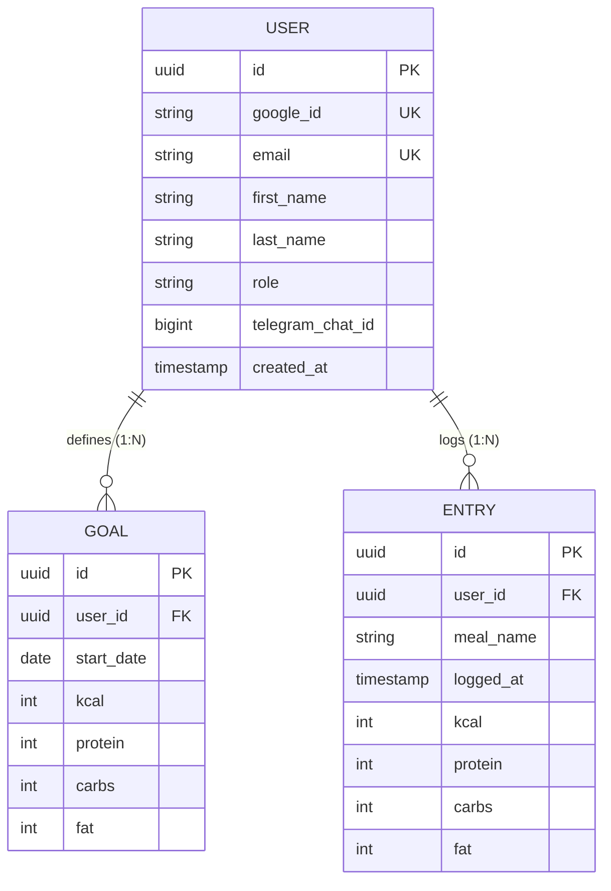

# 🥗 NutritionTracker

NutritionTracker is a modern, high-performance web application and RESTful backend designed to log daily nutrition entries (meals, calories, protein, carbs, fat), track progress against personalized goals, and view interactive monthly analytics.

Built with **Spring Boot 3 (Java 17)** on the backend and **Vite + React + TypeScript + TailwindCSS** on the frontend, featuring a custom **Figma Glassmorphism Design System**.

---

## 🗄️ Database Schema & Data Model



---

## 💻 Tech Stack & Architecture

### **Backend (Spring Boot 3 / Java 17)**
- **Framework:** Spring Boot 3.4 / Java 17
- **Database Persistence:** Spring Data JPA + PostgreSQL (H2 for local dev & automated testing)
- **Security:** Spring Security with OAuth2 / Google Identity Services & `@PreAuthorize` IDOR protection
- **Testing:** JUnit 5, Mockito, Spring Security Test (**74/74 Unit & Integration Tests Passing**)

### **Frontend (Vite + React + TypeScript + TailwindCSS)**
- **UI Architecture:** Vite, React 19, TypeScript, TailwindCSS v4, Lucide React Icons
- **Design System:** Pixel-perfect replication of Figma *CaloriesTrack Glassmorphism Atomic Design*
- **State & REST Client:** Custom type-safe API client wrapper with fallback demo showcase mode

---

## ✨ Key Frontend Features

1. **📊 Glassmorphism Today Dashboard:**
   - **Hero Kcal Card:** Displays remaining calories with 4 SVG Donut Rings (`KCAL`, `CARBS`, `FAT`, `PROTEIN`).
   - **Date Navigator:** Navigate to past days (`<` Previous Day | `Today / Date` | `>` Next Day) to log forgotten meals. Future date navigation is automatically blocked.
   - **Consumed vs Left Table:** Compares consumed values against goals with animated progress bars.

2. **📝 Inline Meal Entry & Edit Sidebar:**
   - Log meals directly inside `LatestEntriesSidebar` with smooth push-down form animations.
   - Click on any meal card or macro numbers to enter **Inline Edit Mode**, update values, and save to the backend.
   - Compact height viewport with clean scrollbar alignment.

3. **📈 Monthly Intake Analytics (`Overview` Tab):**
   - 4 Top KPI Stat Cards (Weekly balance, Active Streak, Goal Accuracy %, Avg Protein).
   - Monthly Bar Chart with bottom-to-top growing bar animations and **`🌟 General Goal Compliance (%)`** dropdown option.
   - 100% dynamic calculation calculated directly from real logged entries (shows `0` when no entries exist).

4. **🔑 Google OAuth Modal & Figma `SidepopUp` Notifications:**
   - Google Sign-In modal popup for user authentication.
   - Replicated exact Figma toast notification (`SidepopUp`) with ultra-smooth 1.4s slide-in/slide-out animations.
   - Animated grey skeleton loading screen during initial state initialization.

5. **🎛️ High-Contrast Header Navigation:**
   - Floating glass header with high-contrast inner track and animated sliding purple gradient indicator pill (`Today` ↔ `Overview`).

---

## 🚀 Getting Started & Local Development

### **Prerequisites**
- Java 17 or higher
- Node.js 18+ and npm
- Maven 3.8+

### **1. Run Backend (Spring Boot)**
```bash
# Clone the repository
git clone https://github.com/ec-mentors/project-module-andres-bs12.git
cd NutritionTracker

# Compile and run unit tests (74 tests)
./mvnw test

# Start the Spring Boot backend server (runs on port 8080)
./mvnw spring-boot:run
```

### **2. Run Frontend (Vite + React)**
In a second terminal window:
```bash
# Navigate to frontend directory
cd frontend

# Install dependencies
npm install

# Start Vite dev server (runs on http://localhost:5173)
npm run dev
```

### **3. Production Bundle Build**
To build the static frontend bundle into Spring Boot's static resources:
```bash
npm --prefix frontend run build
```
The static assets are emitted directly to `src/main/resources/static/`, allowing Spring Boot to serve the SPA natively.

---

## 📌 Project Management & Sprint Roadmap

Task tracking and sprint planning are managed via **GitHub Issues & Projects** and synchronized with **Jira Cloud**.

* 🚀 **[View Live GitHub Issues & Backlog](https://github.com/ec-mentors/project-module-andres-bs12/issues)**
* 📊 **[View Interactive GitHub Project Board](https://github.com/users/andres-bs12/projects/3)**

---

## 🎯 Sprint History & Status

### ⚙️ **Sprint 1: Back-End Core (Jul 27 – Aug 10, 2026)** — ✅ `Completed`
- Built foundational Spring Boot architecture (Entities, DTOs, Mappers, Repositories, Services, Controllers, and PostgreSQL Schema).
- Decoupled DTO payload layer (`RequestDTO` / `ResponseDTO`) with `@Component` Mappers and Google OAuth identity linking (`google_id`).

### 🔒 **Sprint 2: DTO Refactoring, Security Ownership & Testing (Aug 03 – Aug 10, 2026)** — ✅ `Completed`
- Modernized DTO layer with Java Records & MapStruct (Issue #12).
- Implemented Spring Security IDOR protection & RBAC `@PreAuthorize` ownership checks (Issue #11).
- Built automated unit and integration test suite with 74 tests passing (Issue #520).

### 🎨 **Sprint 3: Front-End Architecture, Figma UI & REST Integration (Aug 10 – Aug 24, 2026)** — ✅ `Completed`
- Designed and built the Vite + React + TypeScript frontend matching the Figma glassmorphism design system.
- Implemented `HeroKcalCard`, SVG Donut Rings, `ConsumedVsLeftTable`, `LatestEntriesSidebar` with inline editing, and `OverviewDashboard` analytics.
- Integrated REST client API service (`api.ts`) communicating with Spring Boot controllers.
- Integrated Figma `SidepopUp` notification toasts, Date Navigator, Skeleton Loader, and Google OAuth login modal.

---

## 🧠 Architectural Decision Records (ADRs)

### 💡 ADR-01: Pivot to Google OAuth & Identity Linking
- **Status:** Approved
- **Decision:** Replacing manual password auth with Google OAuth eliminates password hashing and reset overhead while offering one-click login. The `User` record in PostgreSQL serves as the core authority, with Google OAuth handling web authentication and Telegram as a secondary channel via token pairing (`/start <token>`).

### 💡 ADR-02: User Data Ownership & IDOR Protection via Spring Security
- **Status:** Approved
- **Context & Security Realization:** Passing `requestingUserId` as an HTTP parameter creates severe **IDOR (Insecure Direct Object Reference)** vulnerabilities where malicious users could spoof request IDs.
- **Solution:** Implemented domain-specific `UserPrincipal` wrapper implementing `UserDetails`. Delegated record-level authorization to Spring Security (`@EnableMethodSecurity` + `@PreAuthorize("@entrySecurity.isOwner(#entryId, principal)")`), performing a 100% type-safe `UUID` to `UUID` comparison against the cryptographically verified security context in memory.

### 💡 ADR-03: Role-Based Access Control (RBAC)
- **Status:** Approved
- **Solution:** Implemented standard Spring Security Roles (`hasRole('ADMIN')`) backed by `GrantedAuthority` (`SimpleGrantedAuthority("ROLE_ADMIN")`). Roles decouple security rules from individual user identities, enabling dynamic, environment-based administration in PostgreSQL.

---

## 📄 License
This project is open-source and developed for the NutritionTracker module.
