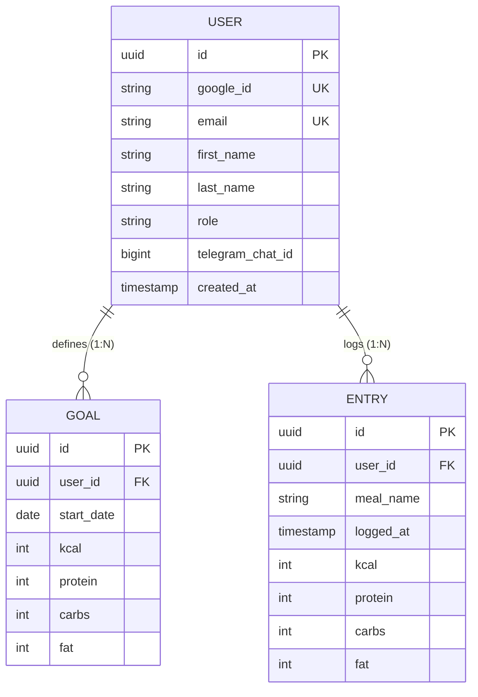

# 🥗 NutritionTracker

NutritionTracker is a modern, high-performance web application and RESTful backend designed to log daily nutrition entries (meals, calories, protein, carbs, fat), track progress against personalized goals, and view interactive monthly analytics.

Built with **Spring Boot 3 (Java 17)** on the backend and **Vite + React 19 + TypeScript + TailwindCSS v4** on the frontend, featuring a custom **Figma Glassmorphism Design System** with **Light & Dark Glass Mode** support.

---

## 📖 Documentation Index

- 📓 **[Backend Learning Journal (docs/learning_journal.md)](docs/learning_journal.md):** Complete architectural decisions, security models, Spring AI deep stubs, and backend development notes.
- 🤖 **[Frontend Learning Journal (frontend/LEARNING_JOURNAL.md)](frontend/LEARNING_JOURNAL.md):** UI takeaways, technical learnings, and AI-assisted frontend development details.
- 🎨 **[Design & UX Documentation (docs/design_and_ux.md)](docs/design_and_ux.md):** Design philosophy, color system rules, Figma evolutions, and mobile touch UX decisions.
- 🧠 **[AI Integration Guide (docs/ai_integration_guide.md)](docs/ai_integration_guide.md):** Multimodal nutrition analysis, Whisper voice integration, and prompt engineering specifications.

---

## 🗄️ Database Schema & Data Model



---

## 💻 Tech Stack & Architecture

### **Backend (Spring Boot 3 / Java 17)**
- **Framework:** Spring Boot 3.4 / Java 17
- **AI Integration:** Spring AI 1.0 + OpenAI `gpt-5.6-luna` (Text & Multimodal Vision) + Whisper `whisper-1` (Voice Note Transcription)
- **Database Persistence:** Spring Data JPA + PostgreSQL (H2 for local dev & automated testing)
- **Security:** Spring Security with OAuth2 / Google Identity Services & `@PreAuthorize` IDOR protection
- **Testing:** JUnit 5, Mockito Deep Stubs, Spring Security Test, MockMvc (**94/94 Unit & Integration Tests Passing - 100% Green**)

### **Frontend (Vite + React + TypeScript + TailwindCSS)**
- **UI Architecture:** Vite 8, React 19, TypeScript 5.8, TailwindCSS v4, Lucide React Icons
- **Development Method:** AI-Assisted Pair Programming (Google Antigravity / Gemini AI)
- **REST Client & State:** Type-safe API client wrapper (`services/api.ts`) connecting React components to Spring Boot REST endpoints

---

## 🚀 Getting Started & How to Run

### **Prerequisites**
- Java 17 or higher
- Node.js 18+ and npm
- Maven 3.8+
- OpenAI API Key (Restricted with `Model capabilities: Write` and `Audio: Write`)

### **1. Configure Environment Variables**
```bash
export OPENAI_MEAL_PARSER_KEY="sk-proj-your-openai-api-key"
```
> **Note:** The API key works with any OpenAI model (`gpt-5.6-luna`, `gpt-4o`, `gpt-4o-mini`, etc.) and `whisper-1`. The active model can be customized anytime in `src/main/resources/application.properties`.

### **2. Run Frontend Development Server (Root Command)**
From the project root directory:
```bash
npm run dev
```
- Access locally on Mac: `http://localhost:5173`
- Access on mobile phone (Wi-Fi): `http://<your-local-ip>:5173`

### **3. Run Backend Server (Spring Boot + PostgreSQL)**
In a second terminal window from the project root directory:
```bash
# Run complete unit & integration test suite (94 tests)
./mvnw test

# Start the Spring Boot backend server (runs on port 8080)
./mvnw spring-boot:run
```

### **4. Production Bundle Build (Unified Single-Port Mode)**
To compile the static React frontend into Spring Boot's static resources:
```bash
npm run build
```
Emits compiled static assets directly to `src/main/resources/static/`. Running `./mvnw spring-boot:run` will serve both the REST API and the React SPA natively on `http://localhost:8080`.

---

## 📌 Project Management & Sprints

Task tracking and sprint planning are managed via **GitHub Issues & Projects** and synchronized with **Jira Cloud**.

* 🚀 **[View Live GitHub Issues & Backlog](https://github.com/ec-mentors/project-module-andres-bs12/issues)**
* 📊 **[View Interactive GitHub Project Board](https://github.com/users/andres-bs12/projects/3)**

---

## 📄 License
This project is open-source and developed for the NutritionTracker module.
