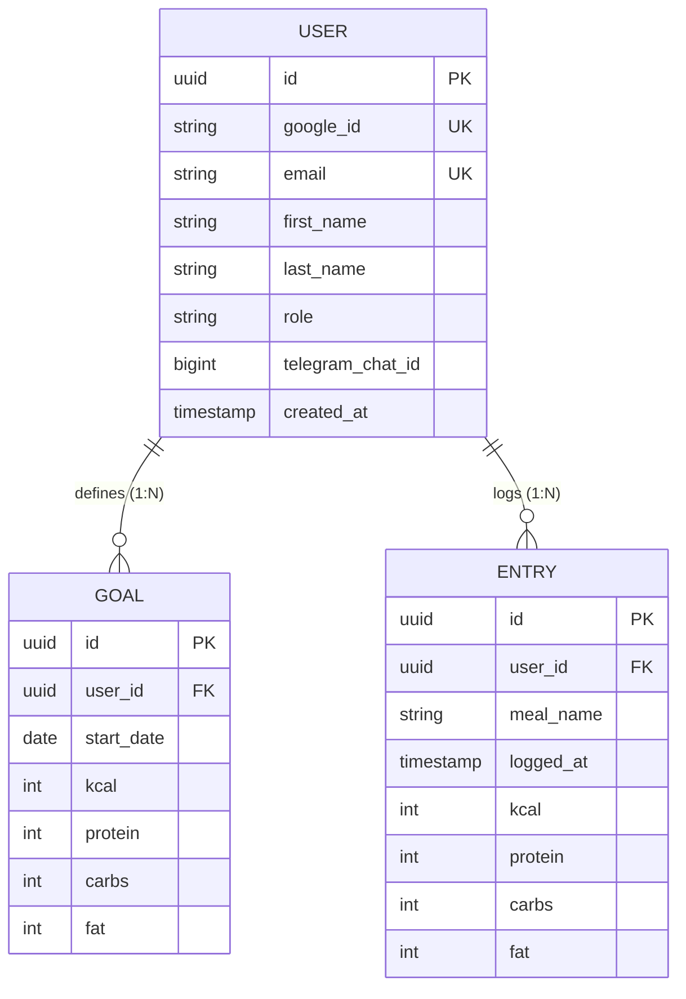

# 🥗 NutritionTracker

NutritionTracker is a modern, high-performance Spring Boot application designed to help users log daily nutrition entries (meals, calories, macros) and track them against personalized nutritional goals.

---

## 🗄️ Database Schema & Data Model

---

## 📌 Project Management & Live Roadmap

Task tracking and sprint planning are managed natively via **GitHub Issues & GitHub Projects** (v2) and synchronized with **Jira Cloud**.

* 🚀 **[View Live GitHub Issues & Backlog](https://github.com/ec-mentors/project-module-andres-bs12/issues)**
* 📊 **[View Interactive GitHub Project Board (NutritionTracker Board)](https://github.com/users/andres-bs12/projects/3)**
* 🎯 **Jira Cloud Integration:** Project Key `NT`

---

## 🎯 Sprint Overview

### ⚙️ **Sprint 1: Back-End Core (Jul 27 – Aug 10, 2026)**
- **Goal:** Build foundational Spring Boot architecture (Entities, DTOs, Mappers, Repositories, Services, Controllers, and PostgreSQL Schema).
- **Architecture:** Decoupled DTO payload layer (`RequestDTO` / `ResponseDTO`) with `@Component` Mappers and Google OAuth identity linking (`google_id`).
- **Status:** ✅ `Completed`

### 🔒 **Sprint 2: DTO Refactoring, Security Ownership & Testing (Aug 03 – Aug 10, 2026)**
- **Goal:** Modernize DTO layer with Java Records & MapStruct, enforce Spring Security IDOR protection & RBAC, and build automated unit/integration tests.
- **Tasks & Milestone:** `Milestone: Sprint2`
  - Refactor Boilerplate DTOs with Java Records & MapStruct (✅ `Done` - Issue #12)
  - Investigate and Implement User Data Ownership Security / IDOR Protection (✅ `Done` - Issue #11)
  - Create Automated Unit & Integration Tests for Controllers, Services & Security Evaluators (📅 `In Progress` - Issue #13)

### 🎨 **Sprint 3: Front-End Architecture & REST Client (Aug 10 – Aug 24, 2026)**
- **Goal:** Build the Multi-Page Web Interface matching the Figma design system ("CaloriesTrack Atomic Design v3") and connect UI components to REST API endpoints.
- **Tasks & Milestone:** `Milestone: Sprint3`
  - Design System, Figma Design Tokens (`styles.css`), Header & Layout Components (Issues #14 - #16)
  - Page 1: Home / Daily Dashboard & Kcal Hero, Macro Cards, Comparison Table, Side Panel (Issues #17 - #21)
  - Page 2: Overview / Analytics Dashboard, Monthly Balance KPI, Charts Container (Issues #22 - #25)
  - Page 3: Goal Settings Panel Form & REST API Client Integration (Issues #26 - #28)

---

## 🧠 Architectural Decision Records (ADRs)

### 💡 ADR-01: Pivot to Google OAuth & Future Telegram Linkage
- **Date:** July 30, 2026 | **Status:** Approved
- **Decision:** Replacing manual email/password auth with Google OAuth eliminates password hashing, reset flows, and email verification overhead while providing a superior one-click user login experience.
- **Identity Linking:** The `User` record in PostgreSQL serves as the core authority. Google OAuth handles Web Auth; Telegram serves as a secondary channel via token pairing (`/start <token>`).

### 💡 ADR-02: User Data Ownership & IDOR Protection via Spring Security `@PreAuthorize` & `UserPrincipal`
- **Date:** August 5, 2026 | **Status:** Approved
- **Context & Critical Realization:** Initially attempted passing `requestingUserId` as an HTTP URL parameter (`@RequestParam`). However, critical analysis revealed a severe **IDOR (Insecure Direct Object Reference)** vulnerability: any malicious user could spoof the `userId` in the URL parameter to access or alter private records belonging to another user.
- **Key Learning & Solution:** Realized that user identity must never be trusted from unverified request parameters. Implemented a domain-specific `UserPrincipal` wrapper implementing `UserDetails`. Delegated record-level authorization to Spring Security (`@EnableMethodSecurity` + `@PreAuthorize("@entrySecurity.isOwner(#entryId, principal)")`), performing a 100% type-safe `UUID` to `UUID` comparison against the cryptographically verified security context in memory.

### 💡 ADR-03: Role-Based Access Control (RBAC) vs. Hardcoded Credentials Antipattern
- **Date:** August 5, 2026 | **Status:** Approved
- **Context & Security Analysis:** Evaluated hardcoding specific admin email strings in `@PreAuthorize("principal.username == 'admin@example.com'")`. Discovered that hardcoding specific emails directly in Java annotations is a security antipattern (*Hardcoded Credentials* / *Security Through Obscurity*), leaking admin identities in repositories and forcing recompilation if emails change.
- **Solution:** Implemented standard Spring Security Roles (`hasRole('ADMIN')`) backed by `GrantedAuthority` (`SimpleGrantedAuthority("ROLE_ADMIN")`). Roles decouple security rules from individual user identities, enabling dynamic, environment-based administration in PostgreSQL.
