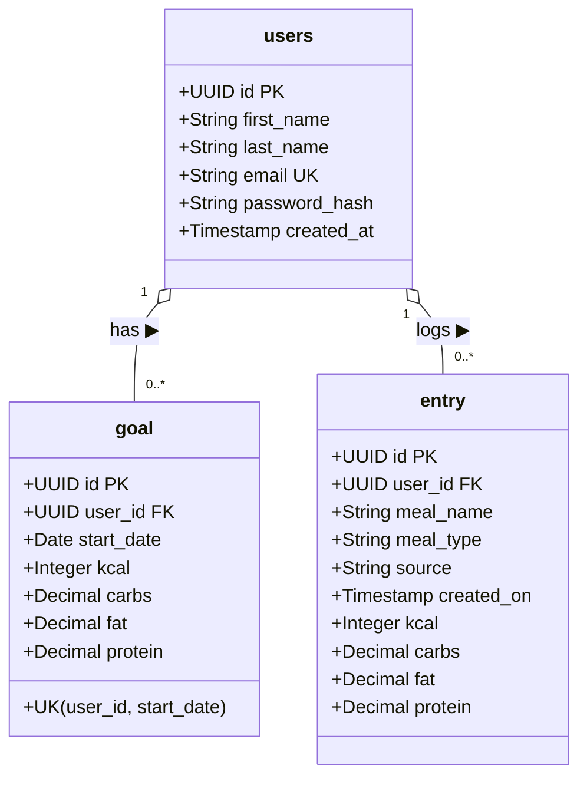
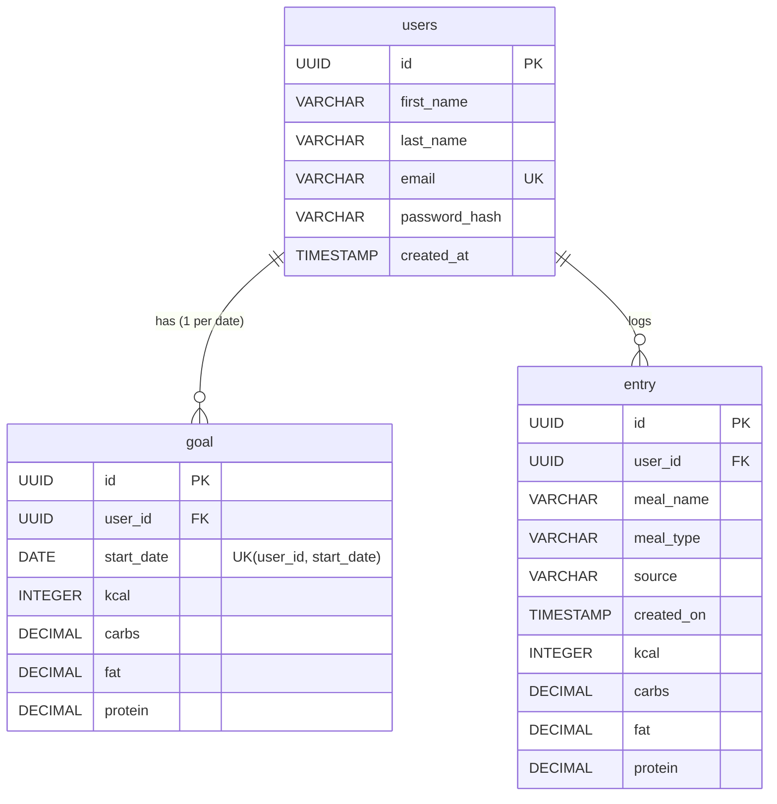

# NutritionTracker

NutritionTracker is a Spring Boot application designed to help users log their daily nutrition entries (meals, calories, macros) and track them against custom daily nutritional goals.

---

## 🎯 Sprint 1: Back-End Roadmap (Jira Board: BE)

**Sprint Duration:** July 27, 2026 – August 10, 2026  
**Goal:** Implement core Spring Boot architecture (Entities, DTOs, Mappers, Repositories, Services, Controllers, and Database Schema).

> 💡 **Architectural Decision:** Using DTOs (`RequestDTO` and `ResponseDTO`) along with dedicated `@Component` Mappers (`UserMapper`, `GoalMapper`, `EntryMapper`) to decouple the public API payload layer from JPA database entities.

### 📋 Sprint 1 Backlog & Tasks (Jira Project: BE)

| Issue Key | Summary | Component | Status | Due Date |
| :--- | :--- | :--- | :---: | :---: |
| **`BE-8`** | Create a diagram | Documentation & DB | ✅ `Done` | Jul 27, 2026 |
| **`BE-4`** | Add entities | Models (`User`, `Goal`, `Entry`) | ✅ `Done` | Jul 27, 2026 |
| ↳ `BE-7` | *Create User entity* | Model (`User.java`) | ✅ `Done` | Jul 27, 2026 |
| ↳ `BE-6` | *Create Goal entity* | Model (`Goal.java`) | ✅ `Done` | Jul 27, 2026 |
| ↳ `BE-5` | *Create Entry entity* | Model (`Entry.java`) | ✅ `Done` | Jul 27, 2026 |
| **`BE-10`** | Add dtos | DTO Layer | ✅ `Done` | Jul 27, 2026 |
| ↳ `BE-11` | *Create User DTO* | DTO (`UserRequestDTO`, `UserResponseDTO`) | ✅ `Done` | Jul 27, 2026 |
| ↳ `BE-12` | *Create Goal DTO* | DTO (`GoalRequestDTO`, `GoalResponseDTO`) | ✅ `Done` | Jul 27, 2026 |
| ↳ `BE-13` | *Create Entry DTO* | DTO (`EntryRequestDTO`, `EntryResponseDTO`) | ✅ `Done` | Jul 27, 2026 |
| **`BE-21`** | Add mappers | Mapper Layer | 🎯 `In Progress` | Jul 27, 2026 |
| ↳ `BE-22` | *Create User Mapper* | Mapper (`UserMapper.java`) | 🎯 `In Progress` | Jul 27, 2026 |
| ↳ `BE-23` | *Create Goal Mapper* | Mapper (`GoalMapper.java`) | 🕒 `To Do` | Jul 27, 2026 |
| ↳ `BE-24` | *Create Entry Mapper* | Mapper (`EntryMapper.java`) | 🕒 `To Do` | Jul 27, 2026 |
| **`BE-14`** | Add repository | Repository Layer | 🕒 `To Do` | Jul 28, 2026 |
| ↳ `BE-15` | *Create User Repository* | JPA (`UserRepository`) | 🕒 `To Do` | Jul 28, 2026 |
| ↳ `BE-17` | *Create Goal Repository* | JPA (`GoalRepository`) | 🕒 `To Do` | Jul 28, 2026 |
| ↳ `BE-16` | *Create Entry Repository* | JPA (`EntryRepository`) | 🕒 `To Do` | Jul 28, 2026 |
| **`BE-18`** | Add service | Service Layer | 🕒 `To Do` | Jul 28, 2026 |
| **`BE-19`** | Add controller | REST Controller Layer | 🕒 `To Do` | Jul 30, 2026 |
| **`BE-20`** | Get presentation ready | Project Delivery | 🕒 `To Do` | Jul 31, 2026 |

---

## 🔮 Sprint 2 Preview & Future Considerations

**Planned Additions:** Week of August 3, 2026

### 🚀 Key Features & Ideas for Sprint 2:
- **Telegram Bot Integration:**
  - Setup and configure Telegram Bot Token.
  - Establish seamless communication between Telegram Bot, Spring Boot API, and Web UI.
- **OpenAI API Integration:**
  - Enable natural language processing to log meals and track nutrition automatically via OpenAI text/voice parsing.
  - Parse user messages into structured `Entry` and `Goal` records.

---

## 📊 Database Architecture

The database is built on PostgreSQL using **UUID** as Primary & Foreign Keys for enhanced security and unguessable URLs. Below is the domain & database model for **Sprint 1**.

### 1. Class Diagram (Java / JPA Domain Model)

### 2. Entity-Relationship Diagram (PostgreSQL ERD)

---

## 🗄️ Database Tables & Constraints

- **`users`**: Stores user profiles.
  - `id`: `UUID PRIMARY KEY DEFAULT gen_random_uuid()` (Globally unique identifier).
  - `email`: `UNIQUE` constraint for web login.
- **`goal`**: Stores daily nutritional goals.
  - `id`: `UUID PRIMARY KEY DEFAULT gen_random_uuid()`.
  - `user_id`: `UUID REFERENCES users(id) ON DELETE CASCADE`.
  - `uk_user_goal_date`: `UNIQUE (user_id, start_date)` constraint ensures only **one goal per user per date**.
- **`entry`**: Stores meal logs (calories, carbs, fat, protein).
  - `id`: `UUID PRIMARY KEY DEFAULT gen_random_uuid()`.
  - `user_id`: `UUID REFERENCES users(id) ON DELETE CASCADE`.
  - `meal_type`: Categorizes meals (`Breakfast`, `Lunch`, `Dinner`, `Snack`).
  - `source`: Tracks entry origin (`Manual` web UI vs future integrations).

The DDL SQL script is located at [`src/main/resources/schema.sql`](src/main/resources/schema.sql).
