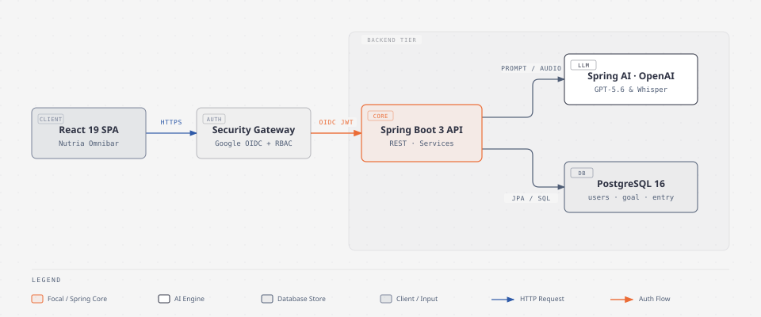
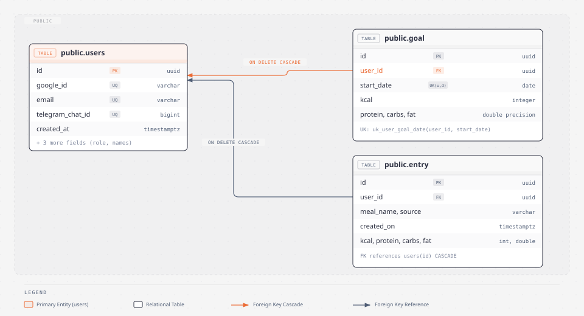

# NutritionTracker

Web app to log meals, track macros against personal goals, and explore monthly progress — with Google Sign-In, optional AI meal parsing (Nutria), and a Telegram bot.

**Live:** [https://tracki.andresbejarano.com](https://tracki.andresbejarano.com)

Built with **Spring Boot 3 (Java 17)** + **Vite / React 19 / TypeScript / Tailwind CSS v4**.

---

## Table of contents

1. [What you can do](#what-you-can-do)
2. [How to use the app (end users)](#how-to-use-the-app-end-users)
3. [Architecture](#architecture)
4. [Database](#database)
5. [Local development](#local-development)
6. [Production deploy (AWS + GHCR + Cloudflare)](#production-deploy-aws--ghcr--cloudflare)
7. [Google OAuth setup](#google-oauth-setup)
8. [Environment variables & secrets](#environment-variables--secrets)
9. [Security](#security)
10. [Tests](#tests)
11. [Docs index](#docs-index)

---

## What you can do

| Feature | Description |
|--------|-------------|
| **Google login** | Sign in once; the app exchanges Google’s ID token for a long-lived app JWT. |
| **Goals / onboarding** | First-time users set calories & macros (AI roadmap or manual). |
| **Nutria chat** | Log meals by text, photo, or voice (OpenAI). |
| **Favorites** | Save frequent meals and re-log them quickly. |
| **Dashboard** | Daily kcal / P / C / F vs goals; monthly overview. |
| **Telegram** | Optional bot pairing from the profile modal. |
| **Demo Mode** | UI preview without a real Google session (no API JWT). |

---

## How to use the app (end users)

### 1. Open the site

Go to **[https://tracki.andresbejarano.com](https://tracki.andresbejarano.com)** (or your own domain after deploy).

### 2. Sign in

1. Click **Sign in with Google**.
2. Choose your Google account and allow the app.
3. First visit → **setup wizard** (AI goals or manual macros).
4. Later visits → dashboard with your saved goals.

> **Demo Mode** only explores the UI. Use Google Sign-In for real data.

### 3. Daily flow (Nutria tab)

1. Tell Nutria what you ate (text), send a photo, or a voice note.
2. Review the draft macros and confirm to log the meal.
3. Watch **Daily Progress** (kcal left, protein, carbs, fat).
4. Use **Favorites** for meals you repeat often.

### 4. Goals & profile

- **Set goals** in the header to change targets anytime.
- **Profile** (avatar): account info, Telegram pairing, theme (light/dark), sign out.

### 5. Overview tab

Monthly-style charts: days met, overshoot, and macro trends vs your goals.

### 6. Privacy

Privacy policy: [https://tracki.andresbejarano.com/privacy.html](https://tracki.andresbejarano.com/privacy.html)  
(Also linked on the login screen — required for Google OAuth Production.)

---

## Architecture

<p align="center">
  
</p>

**High level**

```text
Browser (React SPA)
    │  HTTPS
    ▼
Cloudflare (DNS / optional proxy) → Nginx on EC2 → Docker (Spring Boot :8080)
                                                      │
                                                      ├─ PostgreSQL (AWS RDS)
                                                      ├─ OpenAI (meal / goal AI)
                                                      └─ Telegram API (optional bot)
```

- Frontend is built into Spring `static/` (single origin: UI + `/api`).
- Auth: Google Identity Services → `POST /api/user/auth/google` → app JWT.
- Ownership: `@PreAuthorize` + `principal.id` (IDOR protection).

---

## Database

<p align="center">
  
</p>

Core tables: `users`, `goals`, `entries`, `favorite_meals`, AI quota usage. Local Docker Compose uses Postgres 16; production uses **RDS**.

---

## Local development

### Prerequisites

- Java **17+**
- Node.js **18+** / npm
- Maven 3.8+ (or `./mvnw`)
- PostgreSQL (or `docker compose up db`)
- OpenAI API key (optional for AI features)
- Google OAuth **Web** client ID (for real login)

### 1. Environment

**Frontend** — create `frontend/.env` (see `frontend/.env.example`):

```bash
VITE_GOOGLE_CLIENT_ID=your-client-id.apps.googleusercontent.com
VITE_TELEGRAM_BOT_NAME=YourBotName
```

**Backend** — export (or IDE run config):

```bash
export OPENAI_MEAL_PARSER_KEY="sk-..."
export JWT_SECRET="a-long-random-secret-at-least-32-chars"
export TELEGRAM_BOT_TOKEN=""   # optional
export GOOGLE_OAUTH_CLIENT_ID="$VITE_GOOGLE_CLIENT_ID"  # same client ID
```

DB defaults in `application.properties` point at local Postgres; override with `SPRING_DATASOURCE_*` if needed.

### 2. Database (Docker)

```bash
docker compose up -d db
```

### 3. Frontend (hot reload)

```bash
npm run dev
```

- Desktop: `http://localhost:5173`  
- Vite proxies `/api` → `http://localhost:8080`

### 4. Backend

```bash
./mvnw spring-boot:run
```

API: `http://localhost:8080/api/...`

### 5. Unified build (SPA inside Spring)

```bash
npm run build
./mvnw spring-boot:run
```

Open `http://localhost:8080` — UI + API on one port.

### 6. Full stack with Docker Compose

```bash
export OPENAI_MEAL_PARSER_KEY=...
export JWT_SECRET=...
export GOOGLE_OAUTH_CLIENT_ID=...
docker compose up --build
```

App: `http://localhost:8080`

---

## Production deploy (AWS + GHCR + Cloudflare)

### Current production shape

| Layer | Choice |
|-------|--------|
| Compute | EC2 (`t3.micro`) + Docker |
| Edge | Cloudflare DNS (`tracki.andresbejarano.com`) + Nginx reverse proxy |
| Registry | GitHub Container Registry (`ghcr.io`) |
| DB | AWS RDS PostgreSQL |
| CI/CD | `.github/workflows/deploy-aws.yml` |

**Deploy flow:** GitHub Actions builds the image (Node + Maven) → pushes to GHCR → EC2 only `docker pull` + restart (avoids OOM on small instances).

### Trigger a deploy

1. Push to the branch that contains the workflow (or merge to `main` once merged).
2. GitHub → **Actions** → **Test, Build & Deploy to AWS** → **Run workflow**.
3. Prefer **not** skipping tests unless you know why.

### First-time HTTPS / domain

1. Cloudflare DNS: `A` record for `tracki` (or your subdomain) → EC2 public IP.  
   - Orange cloud (Proxied) is fine; ensure SSL mode matches your origin (Flexible if EC2 has HTTP only; Full once origin has a cert).
2. Nginx on EC2 proxies `:80` → `127.0.0.1:8080`.  
3. Optional: workflow `setup-https-ec2.yml` / script `scripts/ec2-setup-https.sh` for Let’s Encrypt when DNS is **DNS-only**.

The container is bound to **`127.0.0.1:8080`** so the app is not exposed raw on the public IP.

---

## Google OAuth setup

1. [Google Cloud Console](https://console.cloud.google.com/apis/credentials) → OAuth client type **Web application**.
2. **Authorized JavaScript origins** (examples):
   - `http://localhost:5173`
   - `http://localhost:8080`
   - `https://tracki.andresbejarano.com`
3. **OAuth consent screen**
   - **Testing**: only listed test users can sign in.
   - **Production**: any Google account (needs app home + privacy URL).
4. Same client ID in:
   - `VITE_GOOGLE_CLIENT_ID` (frontend build)
   - `GOOGLE_OAUTH_CLIENT_ID` (Spring audience check)

---

## Environment variables & secrets

### GitHub Actions secrets (repo)

| Secret | Purpose |
|--------|---------|
| `EC2_HOST`, `EC2_USER`, `EC2_SSH_KEY` | SSH deploy |
| `GHCR_PULL_USER`, `GHCR_PULL_TOKEN` | EC2 pull from private GHCR (`read:packages`) |
| `SPRING_DATASOURCE_URL`, `_USERNAME`, `_PASSWORD` | RDS |
| `JWT_SECRET` | Sign app JWTs |
| `OPENAI_MEAL_PARSER_KEY` | AI features |
| `TELEGRAM_BOT_TOKEN` | Optional bot |
| `VITE_GOOGLE_CLIENT_ID` | Embedded in frontend build **and** passed as `GOOGLE_OAUTH_CLIENT_ID` |

Push to GHCR uses `GITHUB_TOKEN` with `packages: write` on the deploy job.

---

## Security

- **Auth:** Google ID token verified with **audience** = your OAuth client ID; then app JWT.
- **Authz:** `@PreAuthorize` / IDOR checks on goals, entries, favorites, AI.
- **Secrets:** not in the image; injected at `docker run`.
- **Transport:** public HTTPS via Cloudflare/Nginx; app listens on localhost only.

Interactive audit canvas (Cursor): open  
`canvases/nutritiontracker-security-audit.canvas.tsx`  
in the project canvases folder.

Latest automated check: **173 tests, 0 failures** (including secured CRUD / auth suites).

---

## Tests

```bash
./mvnw test
```

Focused security / auth suites:

```bash
./mvnw test -Dtest='*Secured*,*Auth*,GoogleAuthFilterTest,UserControllerTest'
```

CI quality gate runs unit tests (and can run Postman/Newman when re-enabled) before deploy.

---

## Docs index

| Doc | Content |
|-----|---------|
| [docs/learning_journal.md](docs/learning_journal.md) | Backend decisions, JWT, AWS notes |
| [frontend/LEARNING_JOURNAL.md](frontend/LEARNING_JOURNAL.md) | Frontend learnings |
| [docs/design_and_ux.md](docs/design_and_ux.md) | Design system / UX |
| [docs/ai_integration_guide.md](docs/ai_integration_guide.md) | AI / Whisper / prompts |
| [docs/full_stack_rest_integration_guide.md](docs/full_stack_rest_integration_guide.md) | REST client integration |
| [docs/guia_control_tokens_ia.md](docs/guia_control_tokens_ia.md) | AI token / rate limits |
| [frontend/public/privacy.html](frontend/public/privacy.html) | Privacy policy (prod) |

---

## Project tracking

- [GitHub Issues](https://github.com/ec-mentors/project-module-andres-bs12/issues)
- [Project board](https://github.com/users/andres-bs12/projects/3)

---

## License / notes

Academic / personal project module. Do not commit real API keys or `.pem` files. Prefer GitHub secrets and local `.env` (gitignored).
