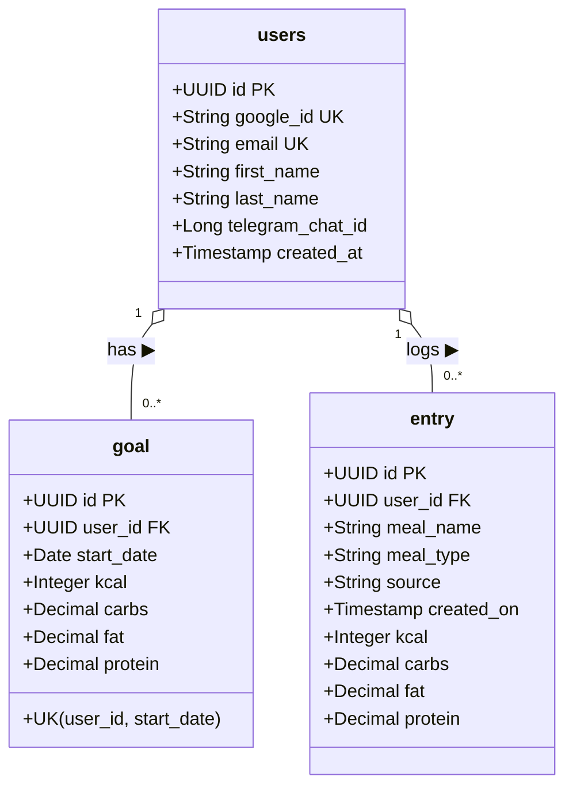
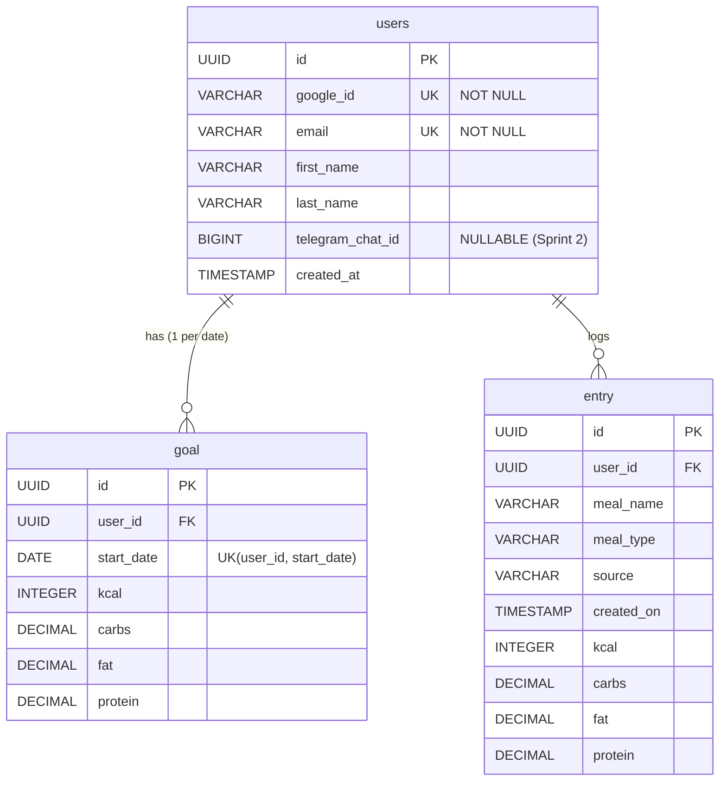

# NutritionTracker

NutritionTracker is a Spring Boot application designed to help users log their daily nutrition entries (meals, calories, macros) and track them against custom daily nutritional goals.

---

## 🎯 Sprint 1: Back-End Roadmap (Jira Board: `BE` | Parent Epic: `BE S1` - `BE-55`)

**Sprint Duration:** July 27, 2026 – August 10, 2026  
**Goal:** Implement core Spring Boot architecture (Entities, DTOs, Mappers, Repositories, Services, Controllers, and Database Schema).

> 💡 **Architectural Decision:** Using DTOs (`RequestDTO` and `ResponseDTO`) along with dedicated `@Component` Mappers (`UserMapper`, `GoalMapper`, `EntryMapper`) to decouple the public API payload layer from JPA database entities.

### 📋 Sprint 1 Backlog & Tasks (Jira Project: `BE` | Parent Epic: `BE S1`)

| Issue Key | Summary | Component | Status | Due Date |
| :--- | :--- | :--- | :---: | :---: |
| **`BE-8`** | Create a diagram | Documentation & DB | ✅ `Done` | Jul 27, 2026 |
| **`BE-4`** | Add entities | Models (`User`, `Goal`, `Entry`) | ✅ `Done` | Jul 27, 2026 |
| ↳ `BE-7` | *Create User entity* | Model (`User.java`) | ✅ `Done` | Jul 27, 2026 |
| ↳ `BE-6` | *Create Goal entity* | Model (`Goal.java`) | ✅ `Done` | Jul 27, 2026 |
| ↳ `BE-5` | *Create Entry entity* | Model (`Entry.java`) | ✅ `Done` | Jul 27, 2026 |
| **`BE-10`** | Add dtos | DTO Layer | ✅ `Done` | Jul 27, 2026 |
| ↳ `BE-11` | *Create User DTO* | DTO (`UserRequestDTO`, `UserResponseDTO`) | ✅ `Done` | Jul 27, 2026 |
| ↳ `BE-12` | *Create Goal DTO* | DTO (`GoalRequestDTO`, `GoalResponseDTO`) | ✅ `Done` | Jul 27, 2026 |
| ↳ `BE-13` | *Create Entry DTO* | DTO (`EntryRequestDTO`, `EntryResponseDTO`) | ✅ `Done` | Jul 27, 2026 |
| **`BE-21`** | Add mappers | Mapper Layer | ✅ `Done` | Jul 27, 2026 |
| ↳ `BE-22` | *Create User Mapper* | Mapper (`UserMapper.java`) | ✅ `Done` | Jul 27, 2026 |
| ↳ `BE-23` | *Create Goal Mapper* | Mapper (`GoalMapper.java`) | ✅ `Done` | Jul 27, 2026 |
| ↳ `BE-24` | *Create Entry Mapper* | Mapper (`EntryMapper.java`) | ✅ `Done` | Jul 27, 2026 |
| **`BE-14`** | Add repository | Repository Layer | ✅ `Done` | Jul 28, 2026 |
| ↳ `BE-15` | *Create User Repository* | JPA (`UserRepository`) | ✅ `Done` | Jul 28, 2026 |
| ↳ `BE-17` | *Create Goal Repository* | JPA (`GoalRepository`) | ✅ `Done` | Jul 28, 2026 |
| ↳ `BE-16` | *Create Entry Repository* | JPA (`EntryRepository`) | ✅ `Done` | Jul 28, 2026 |
| **`BE-18`** | Add service | Service Layer | ✅ `Done` | Jul 28, 2026 |
| ↳ `BE-25` | *Create User Service* | Service (`UserService.java`) | ✅ `Done` | Jul 28, 2026 |
| ↳ `BE-26` | *Create Goal Service* | Service (`GoalService.java`) | ✅ `Done` | Jul 28, 2026 |
| ↳ `BE-27` | *Create Entry Service* | Service (`EntryService.java`) | ✅ `Done` | Jul 28, 2026 |
| **`BE-19`** | Add controller | REST Controller Layer | ✅ `Done` | Jul 29, 2026 |
| ↳ `BE-28` | *Create User Controller* | REST (`UserController.java`) | ✅ `Done` | Jul 29, 2026 |
| ↳ `BE-29` | *Create Goal Controller* | REST (`GoalController.java`) | ✅ `Done` | Jul 29, 2026 |
| ↳ `BE-30` | *Create Entry Controller* | REST (`EntryController.java`) | ✅ `Done` | Jul 29, 2026 |
| **`BE-20`** | Get presentation ready | Project Delivery | ✅ `Done` | Jul 31, 2026 |

---

### 🧠 Architectural Decision Record (ADR-01): Pivot to Google OAuth & Future Telegram Linkage

**Date:** July 30, 2026  
**Status:** Approved  

#### ❓ Context & Questions Raised:
During Sprint 1, two architectural questions were evaluated:
1. Is traditional Email/Password authentication optimal, or is Google OAuth ("Log in with Google") significantly better for UX?
2. If we pivot to Google OAuth now, will it remain compatible with the planned Telegram Bot integration in Sprint 2?

#### 💡 Decision & Rationale:
- **Pivot to Google OAuth:** Replacing manual email/password auth with Google OAuth eliminates password hashing, reset flows, and email verification overhead while providing a superior one-click user login experience.
- **Identity Linking & Telegram Compatibility:** In our domain model, the `User` record in PostgreSQL is the core authority. Google OAuth serves as the Web Authentication Provider, whereas Telegram will serve as a Communication Channel.
- **Sprint 2 Telegram Scope:** Telegram integration will be implemented in Sprint 2 using a temporary token pairing mechanism (`/start <token>`). This ADR ensures the database schema (`google_id`, `telegram_chat_id`) is pre-configured in Sprint 1 without implementing Telegram logic yet.

---

## 🎨 Sprint 2: Front-End & Multi-Page Roadmap (Jira Board: `BE` | Parent Epic: `FE S2` - `BE-54`)

**Sprint Duration:** August 03, 2026 – August 17, 2026  
**Goal:** Implement the Multi-Page Web Application matching the exact Figma design system ("CaloriesTrack Atomic Design v3") followed by Telegram Bot and OpenAI add-on integrations.

> 💡 **Unified Backlog & Tagging System:**
> - **Parent Epic:** `FE S2` (`BE-54`)
> - **Jira Tags / Labels:** Order & execution sequence codes (`FE-1`, `FE-2`, etc.) and phases (`Phase-1`, `Phase-2`, etc.) are attached as native Jira Labels to keep titles clean and readable.

### 📋 Sprint 2 Backlog & Clean Jira Issues (Jira Cloud Project: `BE`)

| Jira Key | Parent Epic | Clean Summary / Title | Jira Labels / Tags | Status | Target Date |
| :--- | :---: | :--- | :--- | :---: | :---: |
| **`BE-33`** | `FE S2` | **Design System & Global Layout Setup** | `FE-1`, `Phase-1`, `DesignSystem` | ⏳ `In Progress` | Aug 03, 2026 |
| ↳ `BE-34` | `FE S2` | *Setup Figma Design Tokens CSS (`styles.css`)* | `FE-2`, `Phase-1`, `CSS` | ⏳ `In Progress` | Aug 03, 2026 |
| ↳ `BE-35` | `FE S2` | *Build Shared Navigation Header Component* | `FE-3`, `Phase-1`, `Navigation` | ⏳ `In Progress` | Aug 04, 2026 |
| **`BE-36`** | `FE S2` | **Page 1: Home / Daily Dashboard (`index.html`)** | `FE-4`, `Phase-2`, `Page-Home` | 📅 `To Do` | Aug 06, 2026 |
| ↳ `BE-37` | `FE S2` | *Build Kcal Remaining Hero & 4 Macro KPI Cards* | `FE-5`, `Phase-2`, `Hero-KPI` | 📅 `To Do` | Aug 05, 2026 |
| ↳ `BE-38` | `FE S2` | *Build Goal vs Actual Comparison Table* | `FE-6`, `Phase-2`, `ComparisonTable` | 📅 `To Do` | Aug 05, 2026 |
| ↳ `BE-39` | `FE S2` | *Build Latest Entries Side Panel* | `FE-7`, `Phase-2`, `EntriesPanel` | 📅 `To Do` | Aug 06, 2026 |
| ↳ `BE-40` | `FE S2` | *Connect Home page JS to REST API* | `FE-8`, `Phase-2`, `REST-Integration` | 📅 `To Do` | Aug 06, 2026 |
| **`BE-41`** | `FE S2` | **Page 2: Overview / Analytics Dashboard (`overview.html`)** | `FE-9`, `Phase-3`, `Page-Overview` | 📅 `To Do` | Aug 09, 2026 |
| ↳ `BE-42` | `FE S2` | *Build Monthly Balance KPI Row Cards* | `FE-10`, `Phase-3`, `KPI-Cards` | 📅 `To Do` | Aug 08, 2026 |
| ↳ `BE-43` | `FE S2` | *Build Charts Container (Macro Distribution & Trend)* | `FE-11`, `Phase-3`, `Charts` | 📅 `To Do` | Aug 08, 2026 |
| ↳ `BE-44` | `FE S2` | *Connect Overview JS to Analytics REST Data* | `FE-12`, `Phase-3`, `REST-Integration` | 📅 `To Do` | Aug 09, 2026 |
| **`BE-45`** | `FE S2` | **Page 3: Set Goal Management (`goal.html`)** | `FE-13`, `Phase-3`, `Page-Goal` | 📅 `To Do` | Aug 11, 2026 |
| ↳ `BE-46` | `FE S2` | *Build Goal Settings Panel Form* | `FE-14`, `Phase-3`, `GoalForm` | 📅 `To Do` | Aug 10, 2026 |
| ↳ `BE-47` | `FE S2` | *Connect Goal Form to REST API* | `FE-15`, `Phase-3`, `REST-Integration` | 📅 `To Do` | Aug 11, 2026 |
| **`BE-48`** | `FE S2` | **Add-on 1: Telegram Bot Integration** | `EXT-1`, `Phase-4`, `Telegram` | 📅 `To Do` | Aug 14, 2026 |
| ↳ `BE-49` | `FE S2` | *Register Telegram Bot & Handle `/start` Command* | `EXT-2`, `Phase-4`, `Telegram` | 📅 `To Do` | Aug 13, 2026 |
| ↳ `BE-50` | `FE S2` | *Link Telegram Chat ID to User Account* | `EXT-3`, `Phase-4`, `Telegram` | 📅 `To Do` | Aug 14, 2026 |
| **`BE-51`** | `FE S2` | **Add-on 2: OpenAI Natural Language Parser** | `EXT-4`, `Phase-4`, `OpenAI` | 📅 `To Do` | Aug 17, 2026 |
| ↳ `BE-52` | `FE S2` | *Integrate OpenAI API for Voice/Text Meal Logging* | `EXT-5`, `Phase-4`, `OpenAI` | 📅 `To Do` | Aug 16, 2026 |
| ↳ `BE-53` | `FE S2` | *Parse AI Response into Structured `EntryRequestDTO`* | `EXT-6`, `Phase-4`, `OpenAI` | 📅 `To Do` | Aug 17, 2026 |

---

### 🗺️ Step-by-Step Execution Guide for Sprint 2

To build this yourself step-by-step, follow this recommended sequence:

1. **Step 1 (Design System - `BE-34`):** Open `src/main/resources/static/css/styles.css` and define the Figma variables (`:root`) for colors (`#05030d`, `#6417ff`), fonts (`Inter`), glassmorphism cards, and buttons.
2. **Step 2 (Page 1 - Home - `BE-36`):** Create `src/main/resources/static/index.html` with the Header, Kcal remaining hero, 4 KPI cards, Comparison Table, and Latest Entries panel.
3. **Step 3 (Page 2 - Overview - `BE-41`):** Create `src/main/resources/static/overview.html` with the Monthly KPI cards and Charts container.
4. **Step 4 (Page 3 - Goal - `BE-45`):** Create `src/main/resources/static/goal.html` with the `Goal Settings Panel` form.
5. **Step 5 (REST Integration - `BE-40`, `BE-44`, `BE-47`):** Create `src/main/resources/static/js/app.js` to fetch data from `/api/entry` and `/api/goal`, handle form submissions, and update progress bars dynamically.
6. **Step 6 (Add-ons - `BE-48` & `BE-51`):** Implement the Telegram Bot controller and OpenAI API integration services in Spring Boot.

---

## 📊 Database Architecture

The database is built on PostgreSQL using **UUID** as Primary & Foreign Keys for enhanced security and unguessable URLs. Below is the domain & database model for **Sprint 1 & Sprint 2**.

### 1. Class Diagram (Java / JPA Domain Model)

### 2. Entity-Relationship Diagram (PostgreSQL ERD)

---

## 🗄️ Database Tables & Constraints

- **`users`**: Stores user profiles (Google OAuth identity).
  - `id`: `UUID PRIMARY KEY DEFAULT gen_random_uuid()` (Globally unique identifier).
  - `google_id`: `VARCHAR UNIQUE NOT NULL` (Google's unique `sub` identifier).
  - `email`: `VARCHAR UNIQUE NOT NULL` (User's email provided by Google).
  - `telegram_chat_id`: `BIGINT` (Nullable, linked in Sprint 2).
- **`goal`**: Stores daily nutritional goals.
  - `id`: `UUID PRIMARY KEY DEFAULT gen_random_uuid()`.
  - `user_id`: `UUID REFERENCES users(id) ON DELETE CASCADE`.
  - `uk_user_goal_date`: `UNIQUE (user_id, start_date)` constraint ensures only **one goal per user per date**.
- **`entry`**: Stores meal logs (calories, carbs, fat, protein).
  - `id`: `UUID PRIMARY KEY DEFAULT gen_random_uuid()`.
  - `user_id`: `UUID REFERENCES users(id) ON DELETE CASCADE`.
  - `meal_type`: Categorizes meals (`Breakfast`, `Lunch`, `Dinner`, `Snack`).
  - `source`: Tracks entry origin (`Manual` web UI vs Telegram/OpenAI).

The DDL SQL script is located at [`src/main/resources/schema.sql`](src/main/resources/schema.sql).
