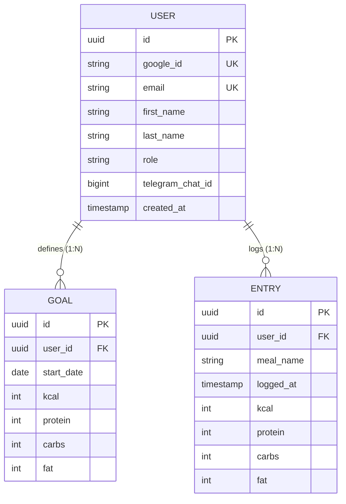

# 🥗 NutritionTracker

NutritionTracker is a modern, high-performance web application and RESTful backend designed to log daily nutrition entries (meals, calories, protein, carbs, fat), track progress against personalized goals, and view interactive monthly analytics.

Built with **Spring Boot 3 (Java 17)** on the backend and **Vite + React 19 + TypeScript + TailwindCSS v4** on the frontend, featuring a custom **Figma Glassmorphism Design System** with **Light & Dark Glass Mode** support.

> 📖 **Architecture & Design Evolution:** For an in-depth breakdown of architectural decisions, Figma design system refinements, and UX improvements, read the [Learning Journal (LEARNING_JOURNAL.md)](LEARNING_JOURNAL.md).

---

## 🗄️ Database Schema & Data Model



---

## 💻 Tech Stack & Architecture

### **Backend (Spring Boot 3 / Java 17)**
- **Framework:** Spring Boot 3.4 / Java 17
- **Database Persistence:** Spring Data JPA + PostgreSQL (H2 for local dev & automated testing)
- **Security:** Spring Security with OAuth2 / Google Identity Services & `@PreAuthorize` IDOR protection
- **Testing:** JUnit 5, Mockito, Spring Security Test (**74/74 Unit & Integration Tests Passing**)

### **Frontend (Vite + React + TypeScript + TailwindCSS)**
- **UI Architecture:** Vite 8, React 19, TypeScript 5.8, TailwindCSS v4, Lucide React Icons
- **Design System:** Custom **Dark & Light Glassmorphism System** (8px spatial grid, high-contrast typography, ambient glow cards)
- **REST Client & State:** Type-safe API client wrapper (`api.ts`) connecting React components to Spring Boot REST endpoints

---

## ✨ Key Frontend & UX Highlights

1. **📊 Glassmorphism Today Dashboard:**
   - **Hero Kcal Card:** Displays remaining calories with 4 SVG Donut Rings (`KCAL`, `CARBS`, `FAT`, `PROTEIN`).
   - **Fixed-Width Date Navigator Pill (`195px`):** Navigate past days (`<` Previous Day | `Today / Date` | `>` Next Day) without layout shifts or arrow jumping. Future dates are automatically blocked.
   - **Consumed vs Left Table:** Compares intake against targets with animated progress bars and a **constant neutral Left column** for optimal readability.

2. **📱 Mobile Touch Delete UX & Safety Confirmation:**
   - Touch action icons are **always visible on mobile viewports**.
   - Inline edit form includes a prominent red `Delete` button and an **inline confirmation dialog** (`Delete [Meal Name]?`) to prevent accidental deletions on touchscreens.

3. **🎯 Dynamic 85%–115% Target Compliance Math:**
   - **Goal Hit (`85%-115%`):** Rendered in official **Brand Purple (`#6417ff`)**.
   - **Goal Exceeded (`>115%`):** Rendered in unified **Rose Red (`#f43f5e`)** across donuts, progress bars, and stats. Over-consuming calories is unhealthy and never marked as "Hit".
   - **In Progress (`<85%`):** Rendered in neutral slate.

4. **📈 Monthly Intake Analytics (`Overview` Tab):**
   - 4 Top KPI Stat Cards (Weekly balance, Active Streak, Goal Accuracy %, Avg Protein) with softened neutral subtext.
   - Interactive monthly vertical bar chart with growing animations, goal lines, and dynamic scaling.

5. **🌊 Left-to-Right Staggered Wave Theme Transitions:**
   - Theme toggle (Sun / Moon) triggers a smooth left-to-right color wave across cards (`delay-0`, `delay-75`, `delay-150`), eliminating harsh screen flashes.

6. **🚫 Global Number Input Stepper Arrow Reset:**
   - `@layer base` CSS reset in `index.css` permanently eliminating browser up/down number arrows across Chrome, Safari, Edge, and Firefox.

---

## 📱 How to View on Mobile Phone (iPhone / Android)

1. Connect your mobile phone to the **same Wi-Fi network** as your computer.
2. Run the Vite dev server with network exposure:
   ```bash
   cd frontend
   npm run dev -- --host 0.0.0.0 --port 5173
   ```
3. Open Safari (iOS) or Chrome (Android) on your mobile phone and navigate to:
   **`http://10.0.0.207:5173`** *(or `http://<your-mac-ip>:5173`)*.
4. *(Optional)* Tap **Share ➔ Add to Home Screen** on Safari to install as a full-screen mobile app!

---

## 🚀 Getting Started & Local Development

### **Prerequisites**
- Java 17 or higher
- Node.js 18+ and npm
- Maven 3.8+

### **1. Run Backend (Spring Boot)**
```bash
# Clone the repository
git clone https://github.com/ec-mentors/project-module-andres-bs12.git
cd NutritionTracker

# Compile and run unit tests (74 tests)
./mvnw test

# Start the Spring Boot backend server (runs on port 8080)
./mvnw spring-boot:run
```

### **2. Run Frontend (Vite + React)**
In a second terminal window:
```bash
cd frontend

# Install dependencies
npm install

# Start Vite dev server exposed to local network (runs on port 5173)
npm run dev -- --host 0.0.0.0 --port 5173
```

### **3. Production Bundle Build**
To build the static frontend bundle for Spring Boot serving:
```bash
npm --prefix frontend run build
```
Emits static assets directly to `src/main/resources/static/`, allowing Spring Boot to serve the SPA natively.

---

## 📌 Project Management & Sprint Roadmap

Task tracking and sprint planning are managed via **GitHub Issues & Projects** and synchronized with **Jira Cloud**.

* 🚀 **[View Live GitHub Issues & Backlog](https://github.com/ec-mentors/project-module-andres-bs12/issues)**
* 📊 **[View Interactive GitHub Project Board](https://github.com/users/andres-bs12/projects/3)**

---

## 📄 License
This project is open-source and developed for the NutritionTracker module.
