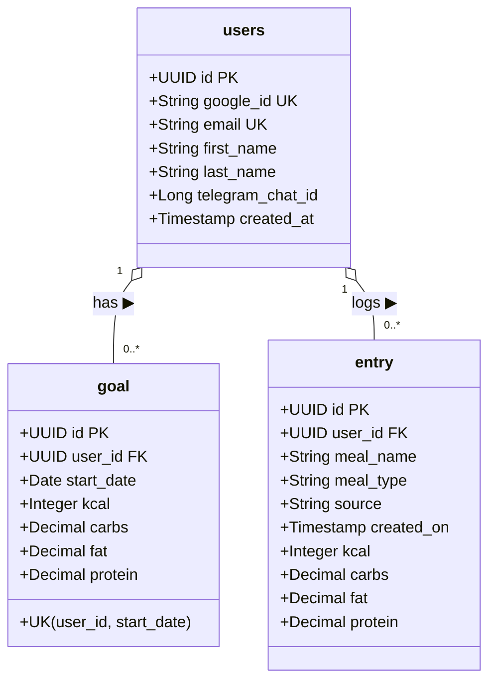
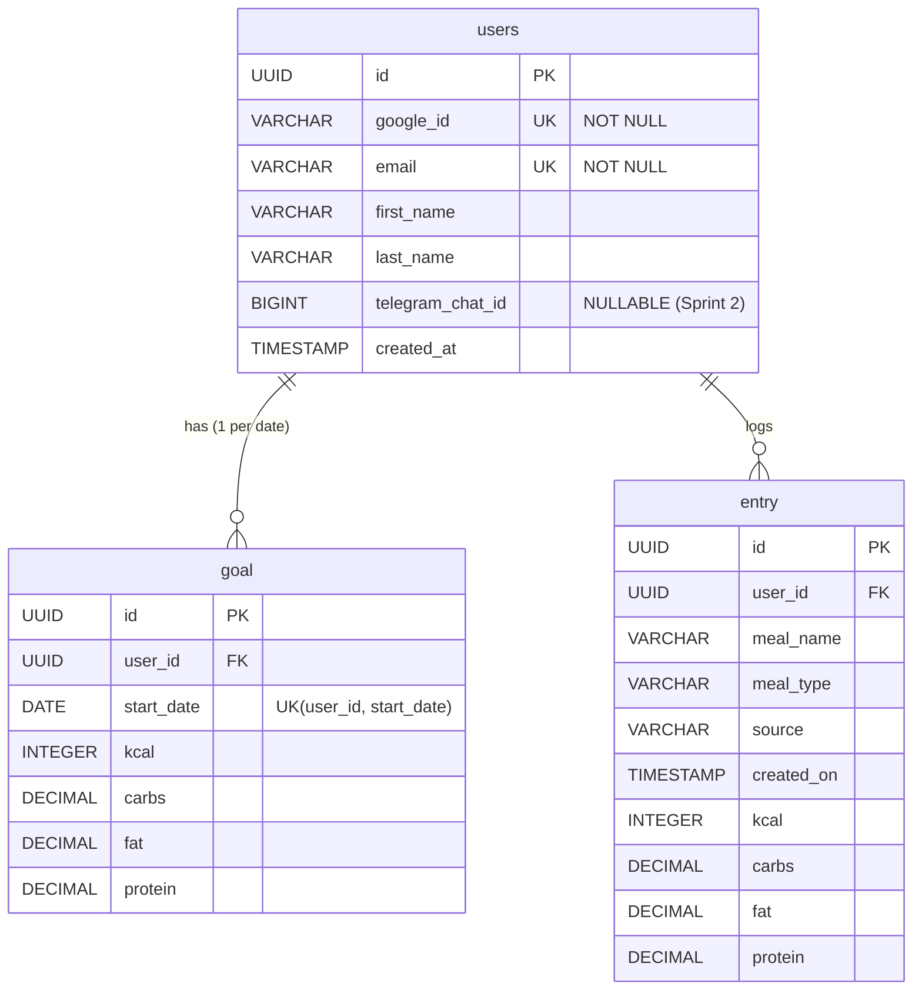

# NutritionTracker

NutritionTracker is a Spring Boot application designed to help users log their daily nutrition entries (meals, calories, macros) and track them against custom daily nutritional goals.

---

## 🎯 Sprint 1: Back-End Roadmap (Jira Board: BE)

**Sprint Duration:** July 27, 2026 – August 10, 2026  
**Goal:** Implement core Spring Boot architecture (Entities, DTOs, Mappers, Repositories, Services, Controllers, and Database Schema).

> 💡 **Architectural Decision:** Using DTOs (`RequestDTO` and `ResponseDTO`) along with dedicated `@Component` Mappers (`UserMapper`, `GoalMapper`, `EntryMapper`) to decouple the public API payload layer from JPA database entities.

### 📋 Sprint 1 Backlog & Tasks (Jira Project: BE)

| Issue Key | Summary | Component | Status | Due Date |
| :--- | :--- | :--- | :---: | :---: |
| **`BE-8`** | Create a diagram | Documentation & DB | ✅ `Done` | Jul 27, 2026 |
| **`BE-4`** | Add entities | Models (`User`, `Goal`, `Entry`) | ✅ `Done` | Jul 27, 2026 |
| ↳ `BE-7` | *Create User entity* | Model (`User.java`) | ✅ `Done` | Jul 27, 2026 |
| ↳ `BE-6` | *Create Goal entity* | Model (`Goal.java`) | ✅ `Done` | Jul 27, 2026 |
| ↳ `BE-5` | *Create Entry entity* | Model (`Entry.java`) | ✅ `Done` | Jul 27, 2026 |
| **`BE-10`** | Add dtos | DTO Layer | ✅ `Done` | Jul 27, 2026 |
| ↳ `BE-11` | *Create User DTO* | DTO (`UserRequestDTO`, `UserResponseDTO`) | ✅ `Done` | Jul 27, 2026 |
| ↳ `BE-12` | *Create Goal DTO* | DTO (`GoalRequestDTO`, `GoalResponseDTO`) | ✅ `Done` | Jul 27, 2026 |
| ↳ `BE-13` | *Create Entry DTO* | DTO (`EntryRequestDTO`, `EntryResponseDTO`) | ✅ `Done` | Jul 27, 2026 |
| **`BE-21`** | Add mappers | Mapper Layer | ✅ `Done` | Jul 27, 2026 |
| ↳ `BE-22` | *Create User Mapper* | Mapper (`UserMapper.java`) | ✅ `Done` | Jul 27, 2026 |
| ↳ `BE-23` | *Create Goal Mapper* | Mapper (`GoalMapper.java`) | ✅ `Done` | Jul 27, 2026 |
| ↳ `BE-24` | *Create Entry Mapper* | Mapper (`EntryMapper.java`) | ✅ `Done` | Jul 27, 2026 |
| **`BE-14`** | Add repository | Repository Layer | ✅ `Done` | Jul 28, 2026 |
| ↳ `BE-15` | *Create User Repository* | JPA (`UserRepository`) | ✅ `Done` | Jul 28, 2026 |
| ↳ `BE-17` | *Create Goal Repository* | JPA (`GoalRepository`) | ✅ `Done` | Jul 28, 2026 |
| ↳ `BE-16` | *Create Entry Repository* | JPA (`EntryRepository`) | ✅ `Done` | Jul 28, 2026 |
| **`BE-18`** | Add service | Service Layer | ✅ `Done` | Jul 28, 2026 |
| ↳ `BE-25` | *Create User Service* | Service (`UserService.java`) | ✅ `Done` | Jul 28, 2026 |
| ↳ `BE-26` | *Create Goal Service* | Service (`GoalService.java`) | ✅ `Done` | Jul 28, 2026 |
| ↳ `BE-27` | *Create Entry Service* | Service (`EntryService.java`) | ✅ `Done` | Jul 28, 2026 |
| **`BE-19`** | Add controller | REST Controller Layer | ✅ `Done` | Jul 29, 2026 |
| ↳ `BE-28` | *Create User Controller* | REST (`UserController.java`) | ✅ `Done` | Jul 29, 2026 |
| ↳ `BE-29` | *Create Goal Controller* | REST (`GoalController.java`) | ✅ `Done` | Jul 29, 2026 |
| ↳ `BE-30` | *Create Entry Controller* | REST (`EntryController.java`) | ✅ `Done` | Jul 29, 2026 |
| **`BE-20`** | Get presentation ready | Project Delivery | ✅ `Done` | Jul 31, 2026 |
| **`BE-28`** | Update `User` Entity & Schema for Google OAuth | Model & DB (`User.java`, `schema.sql`) | ✅ `Done` | Jul 31, 2026 |
| **`BE-29`** | Refactor User DTOs & Mapper | DTO & Mapper Layer | ✅ `Done` | Jul 31, 2026 |
| **`BE-30`** | Add Google OAuth2 Client Dependencies | Build Config (`pom.xml`) | ✅ `Done` | Aug 01, 2026 |
| **`BE-31`** | Implement Google Auth Controller & Service | Logic (`UserService.java`, `UserController.java`) | ✅ `Done` | Aug 01, 2026 |
| **`BE-32`** | Postman Verification for Google Auth Flow | QA & Testing | ✅ `Done` | Aug 02, 2026 |

---

### 🧠 Architectural Decision Record (ADR-01): Pivot to Google OAuth & Future Telegram Linkage

**Date:** July 30, 2026  
**Status:** Approved  

#### ❓ Context & Questions Raised:
During Sprint 1, two architectural questions were evaluated:
1. Is traditional Email/Password authentication optimal, or is Google OAuth ("Log in with Google") significantly better for UX?
2. If we pivot to Google OAuth now, will it remain compatible with the planned Telegram Bot integration in Sprint 2?

#### 💡 Decision & Rationale:
- **Pivot to Google OAuth:** Replacing manual email/password auth with Google OAuth eliminates password hashing, reset flows, and email verification overhead while providing a superior one-click user login experience.
- **Identity Linking & Telegram Compatibility:** In our domain model, the `User` record in PostgreSQL is the core authority. Google OAuth serves as the Web Authentication Provider, whereas Telegram will serve as a Communication Channel.
- **Sprint 2 Telegram Scope:** Telegram integration will be implemented in Sprint 2 using a temporary token pairing mechanism (`/start <token>`). This ADR ensures the database schema (`google_id`, `telegram_chat_id`) is pre-configured in Sprint 1 without implementing Telegram logic yet.

---

## 🔮 Sprint 2 Preview & Future Considerations

**Planned Additions:** Week of August 3, 2026

### 🚀 Key Features & Ideas for Sprint 2:
- **Telegram Bot Integration:**
  - Setup and configure Telegram Bot Token.
  - Establish seamless communication between Telegram Bot, Spring Boot API, and Web UI.
- **OpenAI API Integration:**
  - Enable natural language processing to log meals and track nutrition automatically via OpenAI text/voice parsing.
  - Parse user messages into structured `Entry` and `Goal` records.

---

## 📊 Database Architecture

The database is built on PostgreSQL using **UUID** as Primary & Foreign Keys for enhanced security and unguessable URLs. Below is the domain & database model for **Sprint 1**.

### 1. Class Diagram (Java / JPA Domain Model)

### 2. Entity-Relationship Diagram (PostgreSQL ERD)

---

## 🗄️ Database Tables & Constraints

- **`users`**: Stores user profiles (Google OAuth identity).
  - `id`: `UUID PRIMARY KEY DEFAULT gen_random_uuid()` (Globally unique identifier).
  - `google_id`: `VARCHAR UNIQUE NOT NULL` (Google's unique `sub` identifier).
  - `email`: `VARCHAR UNIQUE NOT NULL` (User's email provided by Google).
  - `telegram_chat_id`: `BIGINT` (Nullable, linked in Sprint 2).
- **`goal`**: Stores daily nutritional goals.
  - `id`: `UUID PRIMARY KEY DEFAULT gen_random_uuid()`.
  - `user_id`: `UUID REFERENCES users(id) ON DELETE CASCADE`.
  - `uk_user_goal_date`: `UNIQUE (user_id, start_date)` constraint ensures only **one goal per user per date**.
- **`entry`**: Stores meal logs (calories, carbs, fat, protein).
  - `id`: `UUID PRIMARY KEY DEFAULT gen_random_uuid()`.
  - `user_id`: `UUID REFERENCES users(id) ON DELETE CASCADE`.
  - `meal_type`: Categorizes meals (`Breakfast`, `Lunch`, `Dinner`, `Snack`).
  - `source`: Tracks entry origin (`Manual` web UI vs future integrations).

The DDL SQL script is located at [`src/main/resources/schema.sql`](src/main/resources/schema.sql).
