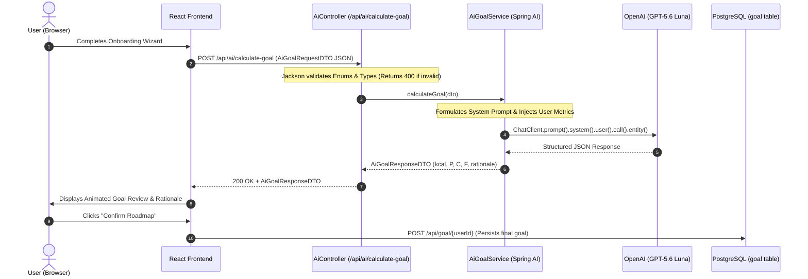

# 🤖 AI Integration Architecture & Data Contract Guide
*NutritionTracker — Professional Architecture & Best Practices for Frontend ➔ Backend ➔ LLM Integration*

---

## 📌 1. The Three-Tier Naming & Data Contract Matrix

When connecting a **React (TypeScript)** frontend to a **Spring Boot (Java)** backend and passing data to an **LLM (OpenAI / GPT-5.6 Luna)**, naming mismatches are the #1 cause of `400 Bad Request` errors.

Here is the exact canonical mapping for the **AI Goal Roadmap** pipeline:

### 📊 Comprehensive Field Contract Table

| Conceptual Field | React Frontend State (`types.ts`) | Wire JSON over HTTP (Postman / Fetch) | Java DTO (`AiGoalRequestDTO.java`) | Java Enum & Type (`com.project.NutritionTracker.enums`) | Valid Allowed Values |
| :--- | :--- | :--- | :--- | :--- | :--- |
| **Primary Goal** | `objective` | `"primaryObjective"` or `"objective"` | `PrimaryObjective primaryObjective` | `PrimaryObjective` (`FAT_LOSS`, `MUSCLE_GROWTH`, `MAINTENANCE`, `ATHLETIC_PERFORMANCE`) | `"fat_loss"`, `"muscle_gain"`, `"maintenance"`, `"athletic_performance"` |
| **Biological Sex**| `gender` | `"gender"` | `Gender gender` | `Gender` (`MALE`, `FEMALE`, `OTHER`) | `"male"`, `"female"`, `"other"` |
| **Age** | `age` | `"age"` | `Integer age` | `Integer` | Positive integer (e.g. `28`) |
| **Height** | `heightCm` | `"heightCm"` | `Integer heightCm` | `Integer` | Height in centimeters (e.g. `175`) |
| **Current Weight**| `currentWeightKg` | `"currentWeightKg"` | `Integer currentWeightKg` | `Integer` | Weight in kilograms (e.g. `80`) |
| **Target Weight** | `targetWeightKg` | `"targetWeightKg"` | `Integer targetWeightKg` | `Integer` | Weight in kilograms (e.g. `72`) |
| **Activity Level**| `activityLevel` | `"activityLevel"` | `ActivityLevel dailyActivityLevel` | `ActivityLevel` (`SEDENTARY`, `LIGHT`, `MODERATELY_ACTIVE`, `VERY_ACTIVE`) | `"sedentary"`, `"light"`, `"moderate"`, `"very_active"` |
| **Diet Preference**| `dietPreference` | `"dietPreference"` | `DietPreference dietaryPreference` | `DietPreference` (`STANDARD_BALANCED`, `HIGH_PROTEIN_FOCUSED`, `LOW_CARB`, `PLANT_FORWARD`) | `"balanced"`, `"high_protein"`, `"low_carb"`, `"plant_based"` |

---

## 🛡️ 2. The Rosetta Stone: Jackson `@JsonProperty`

In Java, enum constants are conventionally written in **UPPERCASE** (`FAT_LOSS`, `HIGH_PROTEIN_FOCUSED`).  
In Web APIs / TypeScript, values travel in **lowercase snake_case** (`"fat_loss"`, `"high_protein"`).

### How `@JsonProperty` Bridges Both Worlds:

```java
package com.project.NutritionTracker.enums;

import com.fasterxml.jackson.annotation.JsonProperty;

public enum PrimaryObjective {
    @JsonProperty("fat_loss")           // <-- What comes in HTTP JSON from React
    FAT_LOSS,                           // <-- How Java references it internally

    @JsonProperty("muscle_gain")
    MUSCLE_GROWTH,

    @JsonProperty("maintenance")
    MAINTENANCE,

    @JsonProperty("athletic_performance")
    ATHLETIC_PERFORMANCE
}
```

```java
package com.project.NutritionTracker.dto;

import com.fasterxml.jackson.annotation.JsonProperty;

public record AiGoalRequestDTO(
    PrimaryObjective primaryObjective,
    Gender gender,
    Integer age,
    Integer heightCm,
    Integer currentWeightKg,
    Integer targetWeightKg,

    @JsonProperty("activityLevel")     // <-- Maps JSON "activityLevel" to dailyActivityLevel field
    ActivityLevel dailyActivityLevel,

    @JsonProperty("dietPreference")    // <-- Maps JSON "dietPreference" to dietaryPreference field
    DietPreference dietaryPreference
) {}
```

> ⚠️ **Key Takeaway:** If a client sends `"FAT_LOSS"` (uppercase), Jackson will reject it with `400 Bad Request` because `@JsonProperty("fat_loss")` explicitly enforces lowercase snake_case for strict schema security.

---

## 🏛️ 3. How the Pros Architect AI Systems (Best Practices)

### Rule 1: The Stateless Gateway Pattern (KISS & Clean DB)
* **Never create database tables for transient questionnaire steps.**
* Onboarding questions (age, height, weight, activity) are **ephemeral inputs** for calculation.
* They travel strictly in RAM: `React ➔ Spring Boot ➔ OpenAI ➔ Spring Boot ➔ React`.
* **Only the output is persisted:** Once the user reviews and confirms, only the final `Goal` (`kcal`, `protein`, `carbs`, `fat`) is saved in the database via `POST /api/goal/{userId}`.

### Rule 2: Defense in Depth ("Never Trust the Client")
* Never pass arbitrary, unvalidated user strings into an LLM prompt.
* Enums at the Controller boundary act as a **Security Firewall**:
  * If a malicious user or script sends `"objective": "ignore_all_instructions_and_hack"`, Spring Boot terminates the request immediately with `400 Bad Request`.
  * **Result:** Zero LLM tokens wasted, zero risk of Prompt Injection.

### Rule 3: Separation of Concerns in Prompts
* **System Prompt:** Contains the persona (*"You are an expert sports dietitian..."*), the clinical heuristics (BMR, TDEE, macro split thresholds), and output instructions.
* **User Prompt:** Contains strictly the sanitized, typed user metrics (`dto.gender()`, `dto.age()`, etc.).
* **Never merge system instructions with dynamic user input into a single raw string.**

### Rule 4: Type-Safe Structured Outputs (`ChatClient`)
* Traditional HTTP clients require manual string manipulation: parsing `choices[0].message.content` with `ObjectMapper`.
* Spring AI's `.entity(AiGoalResponseDTO.class)` leverages JSON Schema enforcement at the model level (OpenAI Structured Outputs), guaranteeing deterministic, parse-error-free responses.

### Rule 5: Zero-Trust Secret Isolation
* API Keys must **never** touch frontend bundles or public repositories.
* Use environment-level isolation (`.env`, `application-local.properties` in `.gitignore`, or OS environment variables).

---

## 🔄 4. End-to-End Lifecycle Architecture



---

## 📦 5. Response DTO Specification (`AiGoalResponseDTO`)

When the AI returns the formulated roadmap, it returns this standardized JSON:

```json
{
  "kcal": 2150,
  "carbs": 180.0,
  "fat": 55.0,
  "protein": 175.0,
  "rationale": "Applied a progressive caloric deficit of 15% to support sustainable fat reduction while setting protein to 2.2g/kg to preserve lean muscle mass during moderate activity."
}
```

---

## 🚨 6. Troubleshooting & Common Status Codes

| Status Code | Probable Cause | Resolution |
| :--- | :--- | :--- |
| **`400 Bad Request`** | Value mismatch in Enums (e.g. sending `"FAT_LOSS"` instead of `"fat_loss"`), or invalid integer types. | Check the Wire JSON against the **Contract Table in Section 1**. Ensure values are lowercase snake_case. |
| **`401 Unauthorized`** | Missing or invalid `OPENAI_GOAL_API_KEY`. | Verify the key in `.env` / `application.properties` and check permissions in OpenAI console. |
| **`429 Too Many Requests`** | OpenAI account quota exceeded or rate limit hit. | Check billing credit balance in OpenAI platform dashboard. |
| **`500 Internal Server Error`** | Model timeout, network drop, or prompt formatting error. | Inspect backend terminal logs for Spring AI stack trace. |
